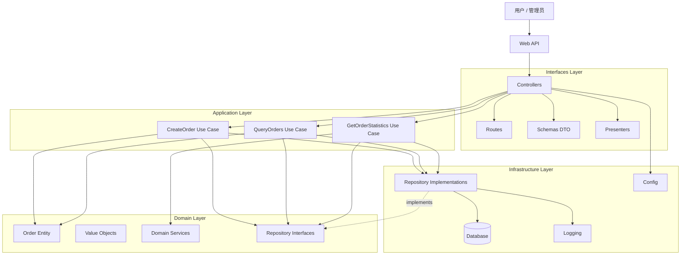
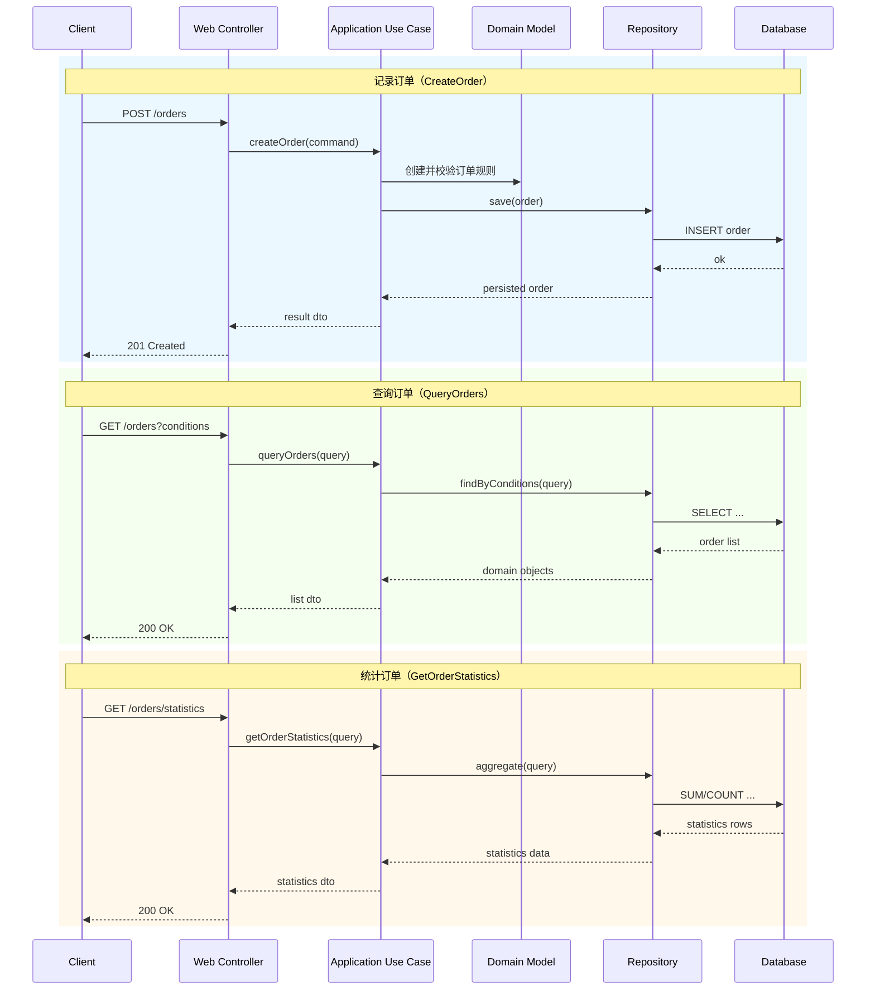

# 架构设计图（初版）

本文档用于配套 [架构设计.md](./架构设计.md)，通过图形方式展示当前阶段（最简单订单系统）的分层关系与核心调用链路。

## 1. Clean 分层架构图

## 2. 订单核心链路（记录/查询/统计）

## 3. 依赖规则提示
- 依赖向内：Interfaces -> Application -> Domain。
- Infrastructure 负责实现接口，不承载业务规则。
- Domain 不依赖框架与数据库。

## 4. 当前阶段约束
- 当前仅聚焦订单子域。
- 仅实现记录、查询、统计三类基础能力。
- 商品、库存、营销、支付等能力暂不纳入。
